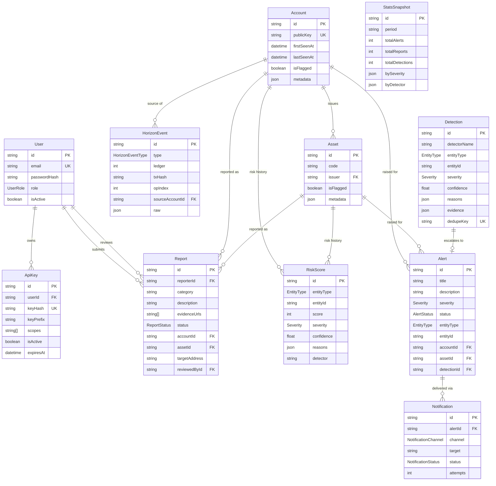

# Entity-Relationship Diagram

Source of truth is `prisma/schema.prisma`. This is a readable rendering of the same model.

## Notes

- `HorizonEvent.raw` stores the normalized, type-specific event payload (see `src/types/horizon.ts`) as JSON — detectors query it with Prisma's JSON path filters rather than requiring a column per operation type.
- `Detection.dedupeKey` is a detector-defined natural key (e.g. `dust-attack:<account>:<time-bucket>`) that prevents the same underlying fact from generating duplicate detections/alerts as events are reprocessed.
- `Alert` links back to at most one `Detection` (`detectionId` is unique) but an entity can accumulate many `Detection`s before/after an alert exists — `RiskScore` history is the append-only ledger of every score computed over time, independent of alerting.
